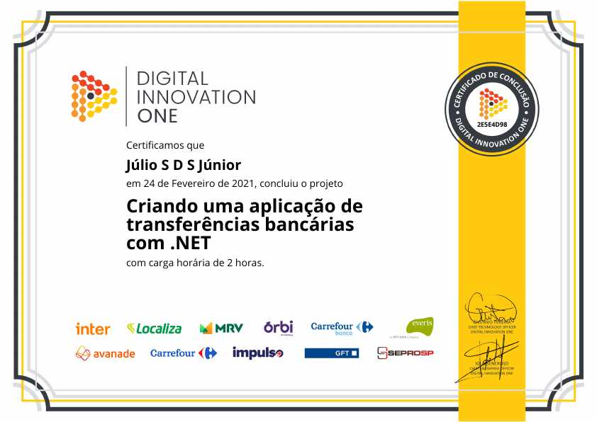

# Criando uma aplicação de transferências bancárias com .NET
## [Digital Innovation One](https://web.digitalinnovation.one/)

* .NET C#

"Aprenda como criar um algoritmo simples de transferência bancária para exercer o pensamento orientado a objetos, o principal paradigma de programação utilizada no mercado. Nesse projeto você vai aprender: Como pensar orientado a objetos, como modelar o seu domínio, como utilizar enums."

